# 一键生成高质量 AI 简报：n8n 工作流最佳实践
## 一、简介

- n8n 是一款开源的低代码工作流自动化工具，专注于将各种应用和服务连接起来，形成自动化的业务流程。它提供了超过400个预置集成，覆盖各类SaaS服务和数据库。既可以通过简单的拖拽操作构建工作流，也可以通过js或Python代码进行更复杂的定制。
- **支持Docker私有化部署**，完全不吃配置，**1核1G**的服务器应该都能跑。
- **适合人群：** 需要高度定制自动化流程的团队、开发者、以及追求效率最大化的中小企业。
- **可以个人或者企业内部但是不能外部商用，商用推荐 dfly**
- 官网：[https://n8n.io/](https://n8n.io/)

## 二、部署 n8n

- 准备一台已安装 docker 的 1h1g 以上的服务器、nas 或者本地电脑
- [https://github.com/n8n-io/n8n](https://github.com/n8n-io/n8n)

```bash
# 创建数据存储卷
docker volume create n8n_data
# 后台运行n8n服务，--rm 如果有改容器就会删除
docker run -it --rm --name n8n -p 5678:5678 -v n8n_data:/home/node/.n8n docker.n8n.io/n8nio/n8n
```

- docker启动后本地电脑使用[http://localhost:5678，](https://link.juejin.cn/?target=http%3A%2F%2Flocalhost%3A5678%25EF%25BC%258C) 服务器用 [http://ip:5678](https://link.juejin.cn/?target=http%3A%2F%2Fip%3A5678)

## 三、汉化

- 汉化包：https://github.com/other-blowsnow/n8n-i18n-chinese/releases

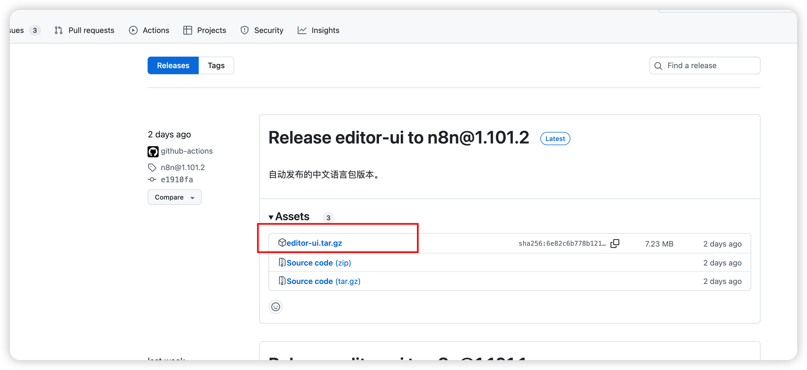

- 如果有汉化需求可以参考该github项目 readme 操作

## 四、jina-reader 部署

- 本文采用 jina reader 来爬取网页文本。Jina Reader 是基于网页抓取、内容清洗、自然语言处理等技术，确保提取内容的准确性和结构化，能够将网页内容转换为适合 LLM 处理的纯文本格式，支持多种输出格式。
- 网址：[https://jina.ai/](https://jina.ai/)
- 计费：免费用户每个账号可以获取 **10,000,000** 个 token，当然也可以自己部署。
- 准备 1h1g 服务器即可运行，当然配置越高支持的并发越高。
- 采用 docker 部署，执行下面指令
- 部署完成后，可以用下面指令试下效果

```bash
curl -H "X-Respond-With: markdown" 'http://localhost:3000/https://www.baidu.com'
```

## 五、AI 简报工作流实战

### 5.1 提前准备

- 目标：定时从掘金人工智能热榜取榜单，并用 jina reader 抓取正文，然后用大模型总结成新闻简报，最后推送到邮箱
- 数据源：[https://juejin.cn/hot/articles/6809637773935378440](https://juejin.cn/hot/articles/6809637773935378440) 打开调试台获取榜单api
    - [https://api.juejin.cn/content_api/v1/content/article_rank?category_id=6809637773935378440&type=hot&aid=2608&uuid=6963437645070976542&spider=](https://api.juejin.cn/content_api/v1/content/article_rank?category_id=6809637773935378440&type=hot&aid=2608&uuid=6963437645070976542&spider=0)1
    
    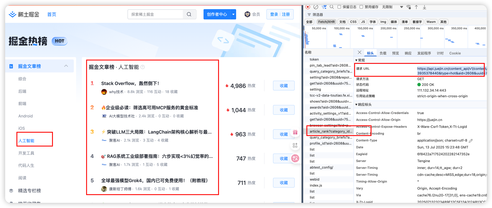
    
- 大模型：使用[硅基流动](https://cloud.siliconflow.cn/) api，新用户有一定的额度，在下面 API 密钥复制密钥，后续会用。
  
    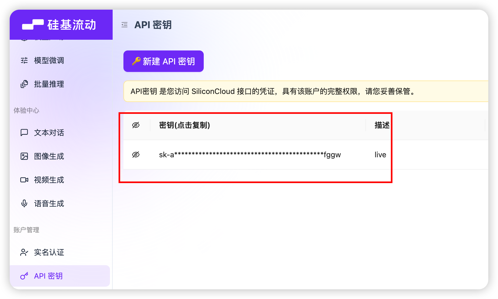
    
- jina reader： 如上图所示
- qq 邮箱授权码：qq 邮箱网页版→设置→ 账号与安全→安全设置→生成授权码→短信验证，获取授权码

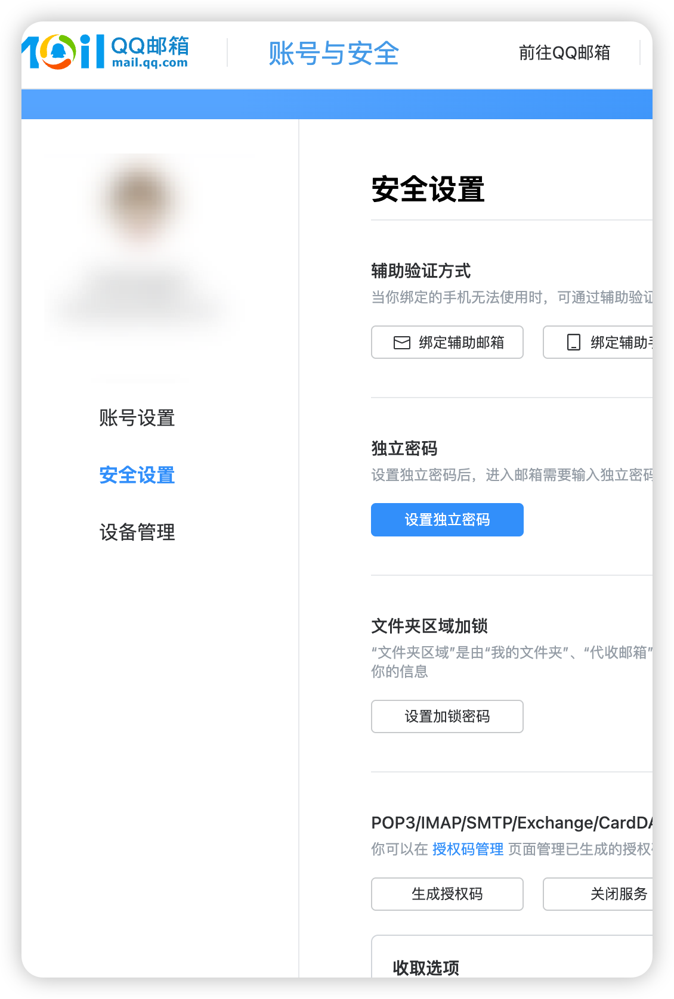

### 5.2 流程实现

- 打开n8n，新建一个 workflow，点右上角+新增节点
  
    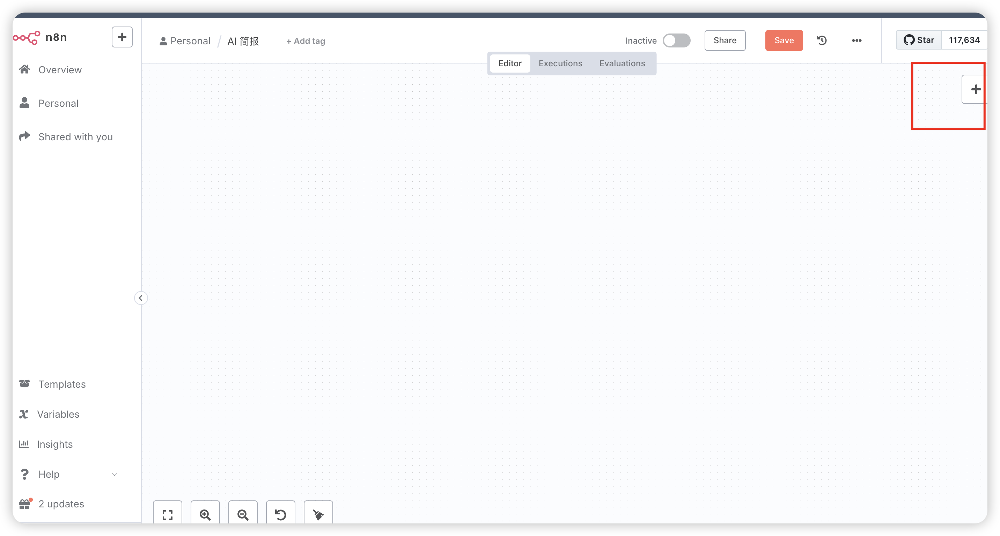
    
1. 触发方式：n8n 支持非常多的工作流触发方式，先选第一个手动触发，方便调试，工作流建好后换成定时，比如每天 8:00 am
   
    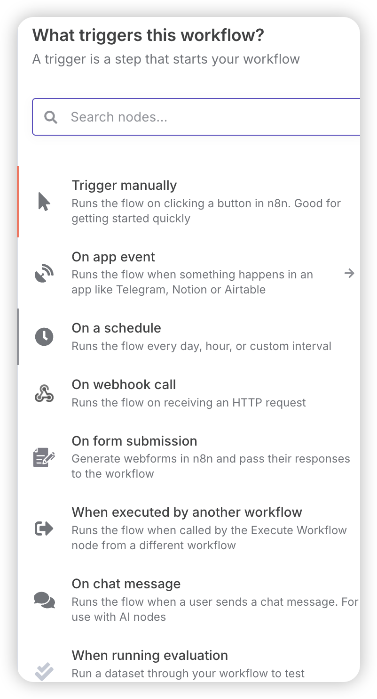
    
2. 抓取 AI 热榜：选择  http request 拉取热榜数据，如下两张图，URL 填：[https://api.juejin.cn/content_api/v1/content/article_rank?category_id=6809637773935378440&type=hot&aid=2608&uuid=6963437645070976542&spider=1](https://api.juejin.cn/content_api/v1/content/article_rank?category_id=6809637773935378440&type=hot&aid=2608&uuid=6963437645070976542&spider=1)
   
    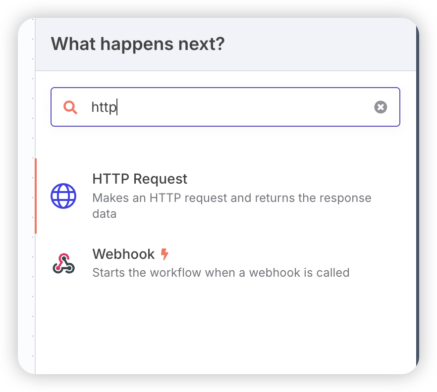
    
    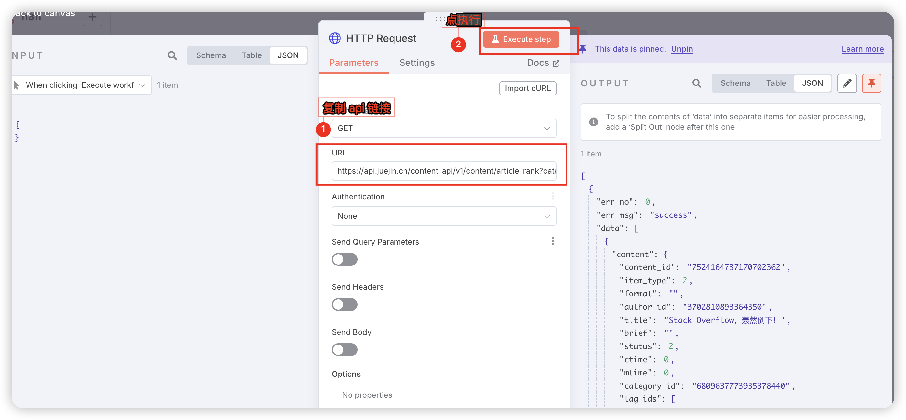
    
3. Split Out 节点：把 data 数据拆成 20 个 items
   
    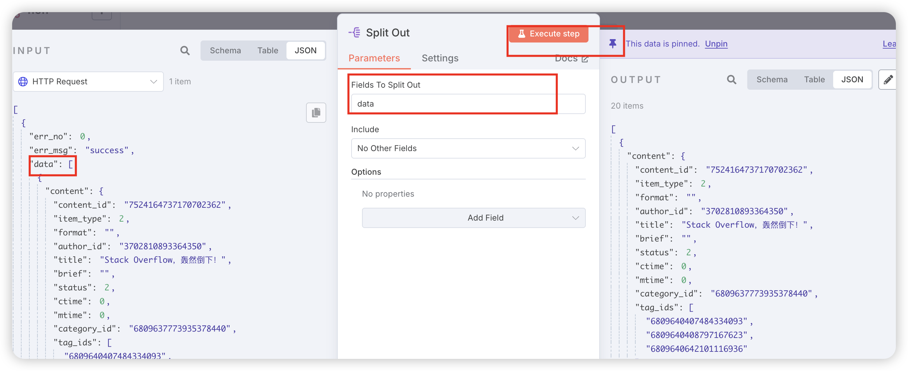
    
4. Limit 节点：这里填 5 条，可以根据个人偏好选择条数
   
    
    
5. 爬取正文：添加 http 节点，URL填：
   
    
    
    ```bash
    http://localhost:3000/https://juejin.cn/post/{{ $json.content.content_id }}
    ```
    
    - http://localhost:3000  换成jina reader 链路
    - {{ $json.content.content_id }} 文章 id
6. 大模型总结：1）AI→AI Agent 点开AI Agent，在Source for Prompt (User Message) 选择 Define below；在Prompt (User Message) 拖左边 input 的 data 拉过来；在Options 加一个System Message，见 6.1。不用管循环，n8n 会自动处理循环。
   
    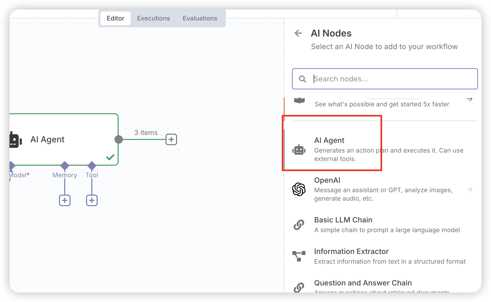
    
    
    
    2）AI Agent 中加 Chat Model：可以用最下面的openai chat model。api key和 base-url 使用硅基流动账号。
    
    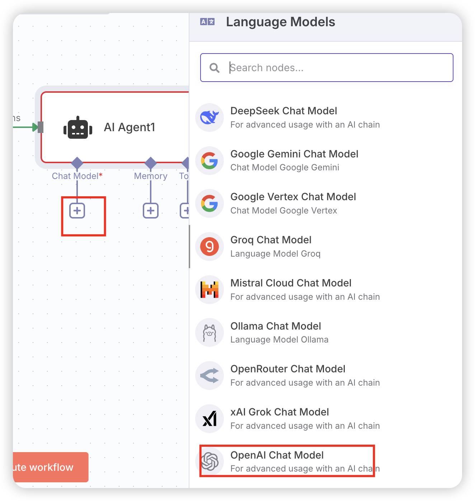
    
7. 格式处理：第 6 步要求大模型输出 json，但是很多时候并不能完全按照要求输出，可以对输出格式化处理。选择 code 节点，Language选择 JavaScript，脚本如下：
   
    
    
    ```jsx
    // 提取并解析每个 output 中的 JSON
    const result = $input.all().map(item => {
        // 移除可能存在的 markdown 代码块标记
        let jsonStr = item.json.output.replace(/```json\n?/g, '').replace(/```\n?/g, '').trim();
        
        // 解析 JSON 字符串
        return JSON.parse(jsonStr);
    });
    
    return result
    ```
    
8. json to HTML：选择 code 节点，Language选择 JavaScript，脚本如 6.2
9. 发送到qq 邮箱：添加 Send email 节点，凭证如下第二张图，Host使用 smtp 地址 smtp.qq.com，Port：465，Password 用之前申请的qq 邮箱授权码


### 5.3 成果展现

按照上面操作完成，点下面的执行工作流程，看执行效果


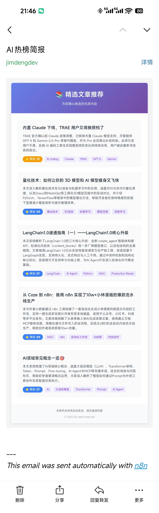

## 六、附件

### 6.1 LLM总结 system prompt

```bash
你是一个擅长总结长文本的助手，能够总结用户给出的文章，请根据下方的文章内容做三件事：

1. **文章摘要**  
   清晰、简洁地总结内容，在3-4句话内吸引读者。

2. **文章评分（1-100）-重要**  
   严格评估文章内容，不考虑类别，但根据以下标准：

   - **重要性和影响（最高30分）**  
     对公众有影响或具有长期政策影响的文章
   - **新内容和信息（最高25分）**  
     提供新信息、新观点或深入背景的文章
   - **报道质量（最高25分）**  
     写作清晰、有引用、有结构，不仅仅是报道文章
   - **报道的吸引力（最高20分）**  
     生动有趣，有细节或与当前事件相关

   **立即扣分** 如果发现以下情况：
   - 广告/宣传文章（-20至-30分）
   - 内容陈旧、重复的新闻文章（-10至-20分）
   - 缺乏来源或使用模糊语言的文章（-10分）

3. **文章标签**  
	 阅读文章内容后给文章打上标签，标签通常是领域、学科或专有名词，要求 2-5 个

---
文章内容：
{{ $json.data }}

---
输出格式：
请严格以JSON格式回答，需包含以下key：
{
  "title": "xxxx"
  "abstract": "xxx"
  "source": "https://juejin.cn/post/7560167720013692974" 
  "score": "75"
  "tags": "AIGC,Python"
}
```

### 6.2 json转html

```bash
function convertToEmailHTML(articles) {
  // 处理 tags，统一转换为字符串
  const formatTags = (tags) => {
    if (Array.isArray(tags)) {
      return tags.join(', ');
    }
    return tags;
  };

  // 根据分数返回不同颜色
  const getScoreColor = (score) => {
    if (score >= 90) return '#10b981'; // 绿色
    if (score >= 80) return '#3b82f6'; // 蓝色
    if (score >= 70) return '#f59e0b'; // 橙色
    return '#ef4444'; // 红色
  };

  const htmlContent = `
<!DOCTYPE html>
<html lang="zh-CN">
<head>
    <meta charset="UTF-8">
    <meta name="viewport" content="width=device-width, initial-scale=1.0">
    <title>精选文章推荐</title>
</head>
<body style="margin: 0; padding: 0; background-color: #f3f4f6; font-family: -apple-system, BlinkMacSystemFont, 'Segoe UI', Roboto, 'Helvetica Neue', Arial, sans-serif;">
    <table width="100%" cellpadding="0" cellspacing="0" style="background-color: #f3f4f6; padding: 20px 0;">
        <tr>
            <td align="center">
                <table width="600" cellpadding="0" cellspacing="0" style="background-color: #ffffff; border-radius: 8px; box-shadow: 0 2px 8px rgba(0,0,0,0.1);">
                    <!-- Header -->
                    <tr>
                        <td style="background: linear-gradient(135deg, #667eea 0%, #764ba2 100%); padding: 30px; text-align: center; border-radius: 8px 8px 0 0;">
                            <h1 style="margin: 0; color: #ffffff; font-size: 28px; font-weight: 600;">📚 精选文章推荐</h1>
                            <p style="margin: 10px 0 0 0; color: #e0e7ff; font-size: 14px;">为您精心挑选的优质内容</p>
                        </td>
                    </tr>
                    
                    <!-- Content -->
                    <tr>
                        <td style="padding: 30px;">
                            ${articles.map((article, index) => `
                            <table width="100%" cellpadding="0" cellspacing="0" style="margin-bottom: ${index < articles.length - 1 ? '25px' : '0'}; border: 1px solid #e5e7eb; border-radius: 6px; overflow: hidden;">
                                <tr>
                                    <td style="padding: 20px; background-color: #fafafa;">
                                        <!-- Title -->
                                        <h2 style="margin: 0 0 12px 0; font-size: 18px; font-weight: 600; color: #1f2937;">
                                            <a href="${article.json.source}" style="color: #1f2937; text-decoration: none;" target="_blank">
                                                ${article.json.title}
                                            </a>
                                        </h2>
                                        
                                        <!-- Summary -->
                                        <p style="margin: 0 0 15px 0; color: #4b5563; font-size: 14px; line-height: 1.5;">
                                            ${article.json.abstract || '暂无摘要'}
                                        </p>
                                        
                                        <!-- Score and Tags in one line -->
                                        <div style="margin-bottom: 0; display: flex; align-items: center; flex-wrap: wrap; gap: 8px;">
                                            <span style="display: inline-block; background-color: ${getScoreColor(article.json.score)}; color: #ffffff; padding: 4px 12px; border-radius: 12px; font-size: 12px; font-weight: 600;">
                                                ⭐ 评分: ${article.json.score}
                                            </span>
                                            ${formatTags(article.json.tags).split(',').map(tag => `
                                                <span style="display: inline-block; background-color: #ede9fe; color: #7c3aed; padding: 3px 10px; border-radius: 4px; font-size: 12px;">
                                                    ${tag.trim()}
                                                </span>
                                            `).join('')}
                                        </div>
                                    </td>
                                </tr>
                            </table>
                            `).join('')}
                        </td>
                    </tr>
                    
                    <!-- Footer -->
                    <tr>
                        <td style="background-color: #f9fafb; padding: 20px; text-align: center; border-radius: 0 0 8px 8px; border-top: 1px solid #e5e7eb;">
                            <p style="margin: 0; color: #6b7280; font-size: 12px;">
                                本邮件由系统自动发送，请勿直接回复
                            </p>
                            <p style="margin: 10px 0 0 0; color: #9ca3af; font-size: 11px;">
                                © ${new Date().getFullYear()} All rights reserved
                            </p>
                        </td>
                    </tr>
                </table>
            </td>
        </tr>
    </table>
</body>
</html>
  `.trim();

  return htmlContent;
}

// 生成 HTML
const emailHTML = convertToEmailHTML($input.all());
return {
  "output": emailHTML
}

```

### 6.3 n8n 工作流

- https://github.com/jimdengdev/n8n-workflow/blob/main/AINews.json